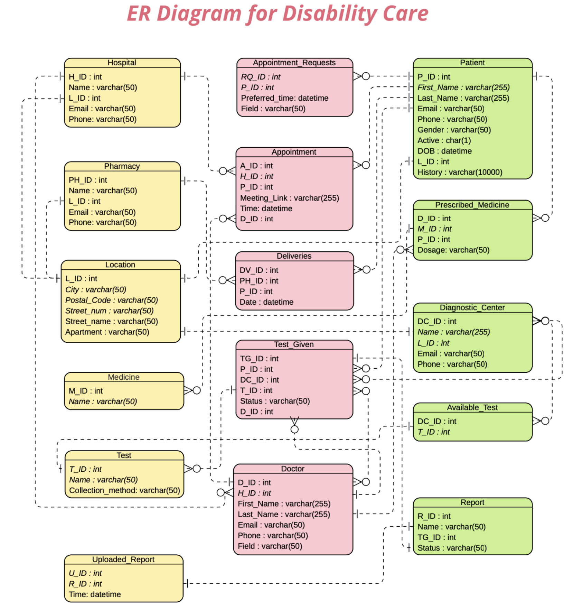
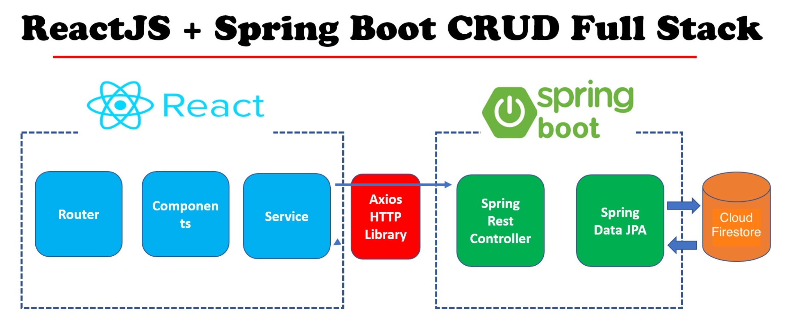
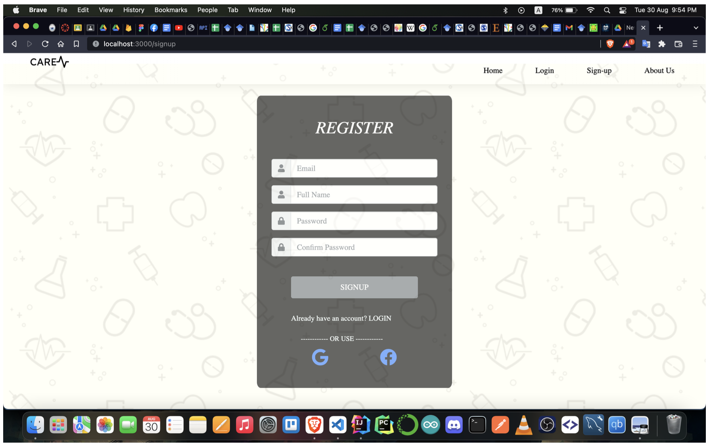
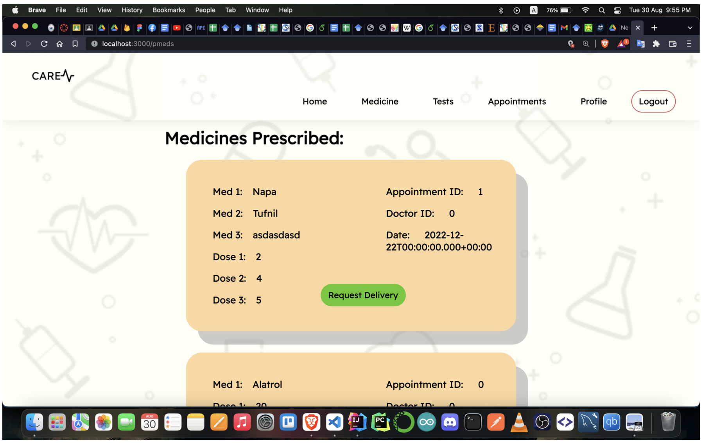

# Disability Care

## Introduction

Disability Care is a web application designed to bridge the gap between people with disabilities and healthcare services. By addressing the barriers faced by individuals with disabilities, such as language and structural difficulties in existing healthcare portals, the system fosters disability independence. It connects users with hospitals, doctors, pharmacies, and diagnostic centers through an intuitive, guided interface, enabling a self-reliant healthcare experience. 

The platform was developed as part of the Junior Design Project (CSE299) at North South University, aiming to provide accessible healthcare solutions to marginalized communities.

## Key Features
- **Patient Management:** Book doctor appointments, view medical reports, and request emergency help.
- **Doctor Portal:** Schedule and conduct video consultations, prescribe medicines, and monitor patient progress.
- **Pharmacy Integration:** Seamlessly manage medicine requests and deliveries.
- **Diagnostic Center:** Streamlined test scheduling and report delivery.
- **Hospital System:** Emergency services, appointment management, and transport facilities.

## Deployment
The project is deployed on Heroku and can be accessed via: [https://disabilitycare.herokuapp.com/](https://disabilitycare.herokuapp.com/)

## Tech Stack

**Frontend:**
- ReactJS
- HTML
- CSS (Bootstrap 5)
- JavaScript

**Backend:**
- Java (Spring Boot Framework)
- Firebase Admin SDK

**Database:**
- Cloud Firestore (NoSQL)

**API Testing and Integration:**
- Axios (Frontend-Backend Communication)
- Postman (API Testing)

## Project Structure

```
Disability_Care/
├── .idea/
├── healthcare_app/
│   ├── .gradle/
│   ├── gradle/wrapper/
│   ├── hcare-app/
│   ├── src/
│   └── ...
├── .DS_Store
├── README.md
├── package.json
├── serviceAccountKey.json
└── ...
```

## System Overview

1. **ER Diagram:**
   The Entity-Relationship (ER) diagram provides a clear overview of the database structure, representing the relationships between various entities such as patients, doctors, pharmacies, and hospitals. This helps to ensure efficient data management and retrieval in the system.

   

2. **Full Stack CRUD Workflow:**
   This diagram illustrates the complete CRUD (Create, Read, Update, Delete) workflow in our full-stack application, highlighting how data flows between the frontend, backend, and database.

   

3. **Sign-Up Page:**
   The sign-up page allows users to register easily by providing essential details, ensuring a smooth onboarding experience.

   

4. **Patient UI:**
   This screenshot demonstrates the user interface designed for patients, showcasing its accessibility and user-friendly layout.

   


## System Design

### Frontend
- **Libraries:** ReactJS was chosen for its modularity and ability to create dynamic web pages.
- **Styling:** Custom CSS and Bootstrap for a modern, responsive design.

### Backend
- **Spring Boot Layers:**
  - Presentation Layer: Handles HTTP requests and JSON transformations.
  - Business Layer: Processes logic and validates data.
  - Persistence Layer: Interacts with Firestore.

- **Database Structure:**
  - Cloud Firestore’s document-based storage ensures scalability and real-time data sync.

### Deployment
- Hosted on Heroku, providing a scalable and accessible cloud-based solution.

## How to Run Locally

1. **Clone the Repository:**
   ```bash
   git clone https://github.com/alifelham/Disability_Care.git
   ```

2. **Navigate to Project Directory:**
   ```bash
   cd Disability_Care/healthcare_app/hcare-app
   ```

3. **Install Dependencies:**
   ```bash
   npm install
   ```

4. **Run Frontend:**
   ```bash
   npm start
   ```

5. **Run Backend:**
   ```bash
   ./gradlew bootRun
   ```

6. **Access Application:**
   Open [http://localhost:3000](http://localhost:3000) in your browser.

## Contributors

- Mohammad Junayed Hasan
- Humayra Anjum
- Alif Elham Khan

## Acknowledgements
We express our gratitude to our supervisor, Dr. Sifat Momen, for his invaluable guidance and support throughout the project.

## License
This project is licensed under the MIT License. See the LICENSE file for details.

---


